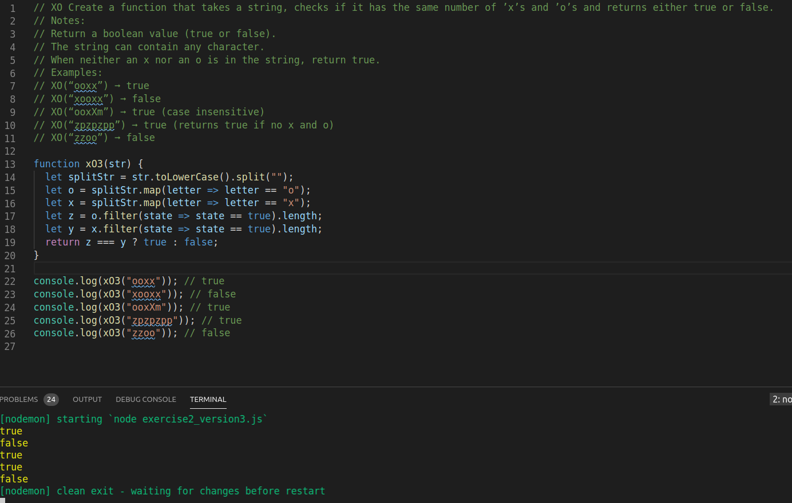

# 3ways_exercise_2



* split the string and turn it into an array 

```
let splitStr = str.toLowerCase().split("");
```
* look for the xs and os and count them with the method filter and adding .length
```
  let o = splitStr.filter(letter => letter == "o").length;
  let x = splitStr.filter(letter => letter == "x").length;
```
> I came to the solution of counting them through .length at stack overflow
> [stack overflow] (https://stackoverflow.com/questions/6120931/how-to-count-the-number-of-certain-element-in-an-array)

* condition if xs are equal to os return true
```
  if (x === o) {
    return true;
  } else {
    return false;
  }
```

* console.log function call 
```
console.log(xO2("ooxx")); // true
console.log(xO2("xooxx")); // false
console.log(xO2("ooxXm")); // true
console.log(xO2("zpzpzpp")); // true
console.log(xO2("zzoo")); // false
```
