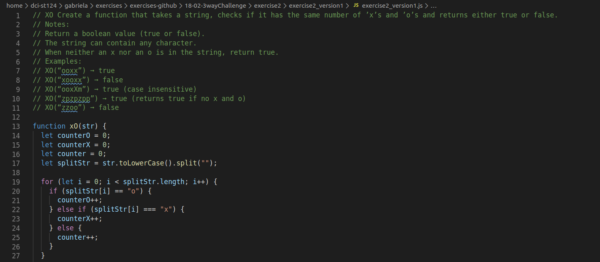
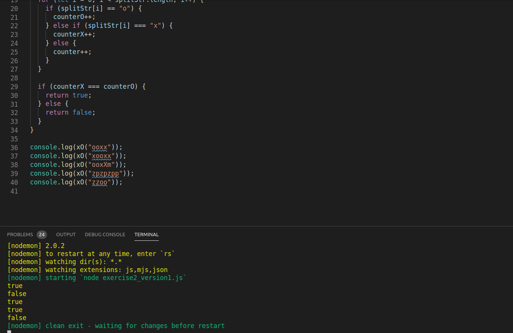

# 3ways_exercise_2




* first I made two couters with default value 0; one for the xs and one for the os

```   let counterO = 0;
       let counterX = 0; 
 ``` 

* I split each character, turning the string into an array


``` let splitStr = str.toLowerCase().split(""); 
 ```

* for loop


```  for (let i = 0; i < splitStr.length; i++) {} 
 ```

* condition: if an index is equal to x or to o, add one to the couter


```     if (splitStr[i] == "o") {
      counterO++;
    } else if (splitStr[i] === "x") {
      counterX++;
    } else {
      counter++;
    } 
 ```

* condition: if the counter with the os is equal to the counter with the xs, it would return true, otherwise false


```    

 if (splitStr[i] == "o") {
      counterO++;
    } else if (splitStr[i] === "x") {
      counterX++;
    } else {
  if (counterX === counterO) {
    return true;
  } else {
    return false;
  }      counter++;
    } 

 ```


* console.log function call

```
 console.log(xO("ooxx"));
console.log(xO("xooxx"));
console.log(xO("ooxXm"));
console.log(xO("zpzpzpp"));
console.log(xO("zzoo"));

```
